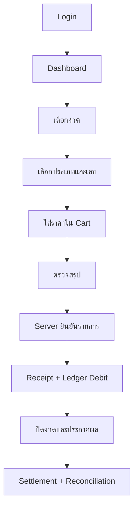

# LOTTOVIP UX/UI Blueprint

เวอร์ชัน: 1.0  
วันที่: 29 กรกฎาคม 2026  
สถานะ: Approved direction for prototype  
ประเภทระบบ: Lottery Operations Simulator + Payment Integration Lab (Sandbox)

## 1. เป้าหมาย

สร้างผลงานสาธิตที่มีประสบการณ์ใช้งานสมจริงระดับผลิตภัณฑ์จริง แต่ใช้ Simulation Credit, Mock Draw และ Payment Sandbox เท่านั้น ระบบต้องสวย ใช้ง่ายบนโทรศัพท์ และตรวจสอบธุรกรรมย้อนหลังได้ทุกขั้นตอน

## 2. หลักฐานที่ใช้ถอดแบบ

- ภาพหน้าจอ 15 ภาพ และวิดีโอบันทึกหน้าจอ 3 ไฟล์ในโฟลเดอร์ `LOTTOVIP หลัก`
- `PRD-Lottery.md`
- `01-N3.csv`
- `ข้อมูล ระบบหวยตใต้ดิน.pdf`
- `ข้อมูลระบบหวย.pdf`

ข้อมูลจากเว็บไซต์ตัวอย่างใช้เพื่อเรียนรู้ Information Architecture, Interaction Pattern และ Workflow เท่านั้น งานใหม่ต้องใช้ชื่อ โลโก้ ภาพ สี ไอคอน และ Component ที่ออกแบบขึ้นใหม่

## 3. สิ่งที่พบจากภาพและวิดีโอ

### 3.1 Global shell

- Header สีเข้ม มีโลโก้ ยอดเครดิต ปุ่มช่วยเหลือ โปรไฟล์ และเมนูเพิ่มเติม
- แถบ Jackpot/Announcement อยู่ใต้ Header
- Mobile-first และเนื้อหายาวแบบเลื่อนลง
- ปุ่มหลักมีสีแยกตามความหมาย เช่น เพิ่มเครดิต ถอน และยืนยัน
- หน้าสมาชิกแสดงยอดเครดิตและชื่อผู้ใช้ในตำแหน่งเด่น

### 3.2 Dashboard

- Wallet summary
- ปุ่ม Deposit และ Withdrawal
- Service grid เช่น รายการตัวเลข ผลรางวัล ประวัติ และโปรโมชั่น
- Banner/Content cards
- Menu card ขนาดใหญ่ กดง่ายด้วยนิ้ว

### 3.3 Round catalog

- แบ่งหมวดงวด
- การ์ดหนึ่งใบต่อหนึ่งงวด
- แสดงธง/ไอคอน ชื่องวด เวลาปิด และ Countdown
- สถานะอย่างน้อย `open`, `closing_soon`, `closed`, `not_open`
- งวดความถี่สูงแบ่งเป็นรอบและปิดเป็นช่วงเวลา

### 3.4 Number-entry screen

- Header แสดงชื่องวด วันที่/รอบ และ Countdown
- สลับ `กดเลขเอง` กับ `เลือกจากแผง`
- Tab ประเภทเลข เช่น 3 ตัว, 2 ตัว, เลขวิ่ง
- Search และกลับตัวเลข
- เลือก Entry Type พร้อมแสดงอัตราจ่าย
- Number grid เช่น 000-999
- สถานะเลขปกติ, เลือกแล้ว, จำกัด, ปิดรับ
- Side rail หรือ bottom actions สำหรับ Cart, ใส่ราคา และรายการ
- แสดงขั้นต่ำ สูงสุด และเงื่อนไขของ Rule Version

## 4. Product Navigation

### 4.1 Bottom navigation

1. หน้าแรก
2. เลือกงวด
3. รายการของฉัน
4. ผล
5. บัญชี

### 4.2 Account menu

- กระเป๋าเครดิต
- Payment Lab
- ประวัติธุรกรรม
- โปรโมชั่นจำลอง
- แจ้งเตือน
- ช่วยเหลือ
- ความปลอดภัย
- ออกจากระบบ

## 5. Screen Inventory

| ID | หน้าจอ | เป้าหมาย | MVP |
|---|---|---|---|
| C01 | Splash/Onboarding | อธิบายว่าเป็นระบบจำลอง | Yes |
| C02 | Register | สร้างบัญชีและยืนยันตัวตน | Yes |
| C03 | Login/Recovery | เข้าใช้และกู้บัญชี | Yes |
| C04 | Dashboard | เครดิต งวดเด่น เมนู และแจ้งเตือน | Yes |
| C05 | Round Catalog | ค้นหา/กรองงวดและดู Countdown | Yes |
| C06 | Round Detail | กติกา เวลา และประเภทเลข | Yes |
| C07 | Number Entry | เลือกประเภทและกรอกเลข | Yes |
| C08 | Entry Cart | ใส่ราคา ตรวจข้อผิดพลาด | Yes |
| C09 | Confirm Entry | สรุปก่อนยืนยัน | Yes |
| C10 | Receipt | หลักฐานจาก Server และ QR ตรวจสอบ | Yes |
| C11 | Entry History | ค้นหาและกรองประวัติ | Yes |
| C12 | Entry Detail | Timeline และ Settlement | Yes |
| C13 | Results | ผลและประวัติย้อนหลัง | Yes |
| C14 | Simulation Wallet | เครดิตและ Ledger | Yes |
| C15 | Payment Lab | Deposit/Withdrawal Sandbox | Phase 2 |
| C16 | Notifications | เหตุการณ์ของบัญชี | Phase 2 |
| C17 | Support Ticket | เปิดและติดตามคำร้อง | Phase 2 |
| A01 | Admin Dashboard | ภาพรวมระบบ | Yes |
| A02 | Round Manager | สร้าง เปิด ปิด และอนุมัติงวด | Yes |
| A03 | Rule Manager | Version กติกาและอัตราจำลอง | Yes |
| A04 | Result Console | Draft/Approve Mock Result | Yes |
| A05 | Settlement Console | Batch, retry และสถานะ | Yes |
| A06 | Reconciliation | ตรวจยอดและข้อคลาดเคลื่อน | Yes |
| A07 | Audit Explorer | ค้นหาเหตุการณ์ย้อนหลัง | Yes |
| A08 | User/Roles | บัญชี สิทธิ์ และ MFA | Phase 2 |

## 6. Core Customer Workflow

## 7. High-frequency Round Workflow

1. ระบบสร้างรอบล่วงหน้าจาก Round Template
2. แต่ละรอบมี `open_at`, `close_at`, `draw_at`
3. Countdown อ้างอิง Server Time
4. เมื่อถึง `close_at` Backend ปฏิเสธรายการใหม่ทันที
5. รอบถัดไปยังเปิดได้โดยไม่ปะปนกับรอบก่อนหน้า
6. ผลจำลองต้องผ่าน Draft และ Approval
7. Settlement ต้องมี Idempotency และ Reconciliation

## 8. Number Entry Interaction

### Mode A: กดเลขเอง

- เลือกจำนวนหลัก
- กรอกเลข
- เลือกประเภท
- เพิ่มหลายราคาได้
- ปุ่มกลับเลขสร้าง Variant ให้ตรวจสอบก่อนเพิ่ม

### Mode B: เลือกจากแผง

- แสดงเลขทั้งหมดตามจำนวนหลัก
- กรองด้วย Search
- แตะเพื่อเลือกหลายเลข
- เลขจำกัดแสดงสีเตือนและเหตุผล
- Sticky summary แสดงจำนวนเลข ยอดรวม และเครดิตคงเหลือ

### Validation

- รูปแบบเลขถูกต้อง
- ราคาอยู่ในช่วงที่ Rule Version อนุญาต
- Round ยังเปิดบน Server
- เครดิตเพียงพอ
- ไม่ส่งรายการซ้ำจากการกดซ้ำ
- ราคาและอัตราที่ใช้ถูก Snapshot ไว้กับ Entry

## 9. Visual Direction

ชื่อชั่วคราวภายใน: `NumberLab VIP`

- Mood: Luxury Dark, Thai Modern, Data-first
- Primary: Deep Burgundy `#730D22`
- Surface: Charcoal `#15171C`
- Accent: Antique Gold `#D6A84B`
- Success: Emerald `#20A464`
- Warning: Amber `#F4A62A`
- Danger: Crimson `#D9364E`
- Text: Off-white `#F5F2EC`
- Font ไทย: Prompt หรือ IBM Plex Sans Thai
- Border radius: 12-18px
- Animation: 160-240ms และลดการเคลื่อนไหวได้

ห้ามใช้โลโก้ ชื่อ ภาพแบนเนอร์ หรือโครงสีแดง-ขาวแบบต้นฉบับตรง ๆ

## 10. Component Set

- AppHeader
- CreditChip
- AnnouncementTicker
- RoundCard
- CountdownBadge
- EntryTypeSelector
- NumberGrid
- NumberKeypad
- RuleBadge
- StickyCartSummary
- ReceiptCard
- StatusTimeline
- LedgerRow
- ApprovalPanel
- ReconciliationSummary
- AuditEventDrawer

## 11. Required States

ทุกหน้าต้องออกแบบสถานะ:

- loading/skeleton
- empty
- success
- validation error
- server error
- offline/retry
- session expired
- round closed during confirmation
- duplicate request returning original receipt

## 12. Prototype Acceptance Criteria

- ใช้งานได้ที่ความกว้าง 360px โดยไม่ล้นแนวนอน
- เลือกงวดถึง Receipt ได้ภายในไม่เกิน 5 หน้าหลัก
- Countdown ต่างจาก Server ไม่เกิน 2 วินาทีหลัง sync
- ปุ่มสำคัญมี touch target อย่างน้อย 44px
- สีข้อความผ่าน WCAG AA ในส่วนสำคัญ
- ไม่สามารถยืนยัน Entry หลังเวลาปิดจาก API
- Refresh หน้า Receipt แล้วข้อมูลยังตรงกับ Server
- ปุ่ม Submit ซ้ำไม่สร้างรายการเพิ่ม

## 13. ลำดับสร้างต้นแบบ

1. Design tokens และ component shell
2. Login + Dashboard
3. Round Catalog
4. Number Entry
5. Cart + Confirmation
6. Receipt + History
7. Results + Wallet
8. Admin Round/Result/Settlement
9. Payment Sandbox
10. Visual QA และ mobile usability test

## 14. Definition of Done สำหรับรอบถัดไป

รอบถัดไปถือว่าเสร็จเมื่อมี Mobile UI Prototype ที่คลิกได้ 5 หน้าหลัก ได้แก่ Login, Dashboard, Round Catalog, Number Entry และ Receipt พร้อมข้อมูลจำลอง และใช้ Design System ใหม่ทั้งหมด
